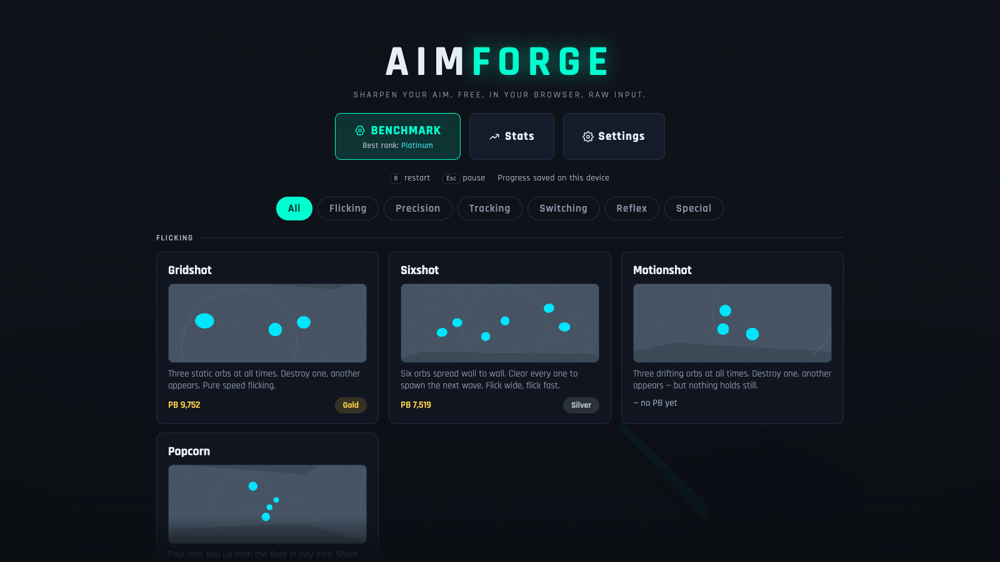
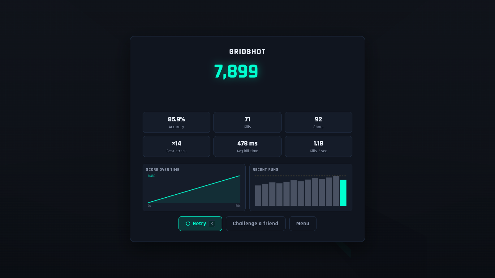

# AIMFORGE

**A free, browser-based FPS aim trainer.** No install, no account, no build step — open it and train. Raw pointer-lock input, real cross-game sensitivity conversion, 14 scenarios across five skill categories, persistent stats and personal bests, and a six-stage benchmark that ranks you Bronze → Grandmaster.

**▶ Play now: [aimforge-sigma.vercel.app](https://aimforge-sigma.vercel.app)** — installable as an app, works offline after the first visit.

  -blue)



## Quick start

Play the [live deployment](https://aimforge-sigma.vercel.app), or serve it yourself — any static file server works (ES modules need `http://`, not `file://`):

```bash
cd aimforge
python3 -m http.server 8080     # or: npm start  (uses npx http-server)
```

Open **http://localhost:8080**, pick a scenario, click START. That's it.

- **R** — instant restart, any time
- **Esc** — pause / back
- **Enter** — next benchmark stage

## Why it holds up against Kovaak's / Aim Lab

- **Raw input.** Pointer lock is requested with `unadjustedMovement: true`, bypassing OS mouse acceleration — the same input path serious trainers use. Mouse deltas are accumulated per frame, so 1000 Hz+ mice are integrated correctly.
- **Real sensitivity conversion.** Enter your DPI plus your in-game sens from Valorant, CS2, Apex, Overwatch 2, CoD, or Quake (correct yaw constants: 0.07 / 0.022 / 0.0066 deg per count), or set cm/360 directly. The settings panel shows your computed cm/360 and eDPI live, so your muscle memory transfers 1:1.
- **Horizontal FOV** setting (default 103, like Valorant/CS2), converted correctly for your actual aspect ratio.
- **Analytic hit detection.** Shots are resolved with exact ray–sphere / ray–capsule math, not mesh raycasts — zero hitbox fudge.
- **Fully customizable crosshair** (cross / dot / circle, color, size, gap, thickness, outline) with a live preview, plus target color, viewmodel toggle, and synthesized zero-latency hit sounds.
- **Local-first stats.** Every run is stored locally: PBs, per-scenario history with trend sparklines, score-over-time graph per run, accuracy, kill times, streaks, reaction-time medians. Back up or move machines with **Settings → Data → Export/Import**.
- **Challenge links.** Every finished run can become a challenge: one click copies a link that replays the *exact same target sequence* (seeded RNG) for whoever opens it, with your score to beat shown on the results screen. No server, no account — the link is self-contained.
- **Installable PWA.** The whole app (including three.js and every scenario) is precached by a service worker: install it from the address bar and train offline.

## Scenarios (14)

| Category | Scenarios | Trains |
|---|---|---|
| **Flicking** | Gridshot, Sixshot, Motionshot, Popcorn | click-timing, wide flicks, moving targets, vertical control |
| **Precision** | Microshot, Longshots, Headhunter | micro-adjustments, cross-screen accuracy, headshot discipline |
| **Tracking** | Smooth Tracking, Air Tracking, Strafebot | smoothness, 3D tracking, reactive control |
| **Switching** | Speed Switch, Multiswitch | target transitions under fire-rate pressure |
| **Reflex** | Reflex Flick | raw reaction time (median/best ms reported) |
| **Special** | Custom Drill | build your own: count, size, speed, distance, weapon, duration |

Every scenario has seven score thresholds (Bronze → Grandmaster) shown as a tier chip on your PB.

## Benchmark

Six stages back to back — Gridshot, Microshot, Smooth Tracking, Strafebot, Speed Switch, Reflex Flick — each scored against its tier thresholds. Your overall rank is the average. No retries mid-gauntlet.



## Development

```bash
npm install          # dev-only deps: puppeteer-core + http-server
npm start            # play at http://localhost:8080
npm run serve:test   # test server on :8317 (separate so your dev server keeps running)
npm test             # E2E suites against :8317 (needs Chrome; CHROME_PATH / AF_URL override)
npm run check        # syntax pass + sw.js precache list must match the files on disk
npm run shots        # screenshot every screen into tests/out/shots/
npm run thumbs       # re-render the scenario card thumbnails in assets/thumbs/
```

The E2E suites drive real headless Chrome (SwiftShader WebGL): `test:smoke` plays every scenario start-to-results and fails on any console error; `test:regression` guards seed determinism, challenge links, backup round-trips, and a set of confirmed fixes. Both run in CI on every push.

## Releasing

Bump `VERSION` in `sw.js` whenever **any** cached file changes — `npm run check` catches list drift, but only a version bump makes installed clients refetch changed contents. `vendor/**` is served immutable, so upgrading three.js means renaming the file.

## Tech

Vanilla ES modules + [three.js](https://threejs.org) r160 (vendored in `vendor/`, MIT). No bundler, no framework, no network dependency after load — fonts (Rajdhani woff2) are self-hosted in `vendor/fonts/`. All persistence is `localStorage`; nothing leaves your machine, and Settings → Data exports all of it as JSON.

The live site runs on Vercel as plain static files (`vercel.json` sets cache headers; brotli cuts the ~1.3 MB `three.module.js` to ~330 KB over the wire). Any static host works the same way.

For the scenario plugin contract (add your own drill in ~40 lines), see **[SCENARIO_API.md](SCENARIO_API.md)** — drop a file in `js/scenarios/`, register it in `js/scenarios/index.js`, done.

## License

MIT. Three.js © Three.js Authors, MIT.
